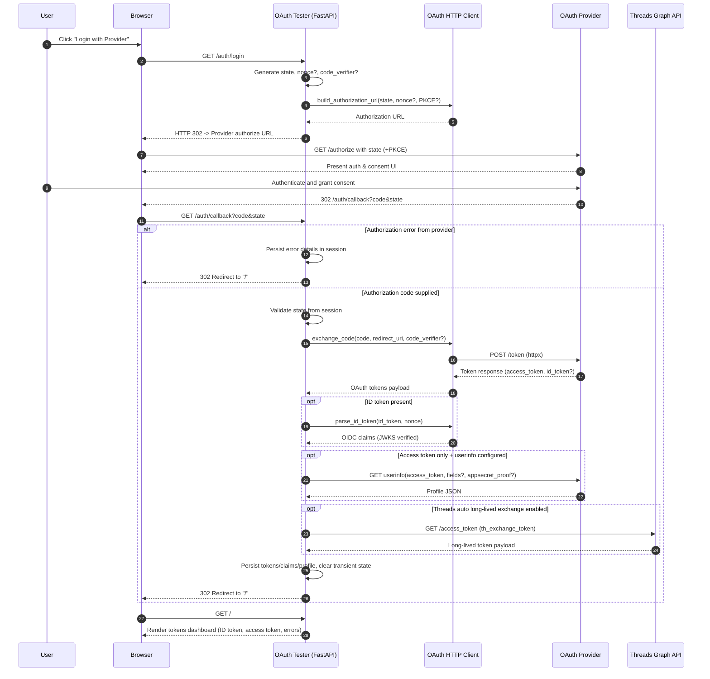

# OAuth Flow Sequence

The diagram below summarizes the interactive login flow implemented by the OAuth Tester application, including optional paths for OIDC verification, user info retrieval, and Threads long-lived token handling.

## Implementation Notes

- The `/auth/login` handler sets the session `state`, optional `nonce`, and PKCE `code_verifier` before asking the manual OAuth client to build an authorization URL, which is returned as a `302` redirect.
- The `/auth/callback` handler validates state, extracts the authorization code, performs the authorization code exchange via `httpx`, and stores resulting tokens, claims, and profile data in the session.
- OIDC providers have ID tokens verified against the configured JWKS (either discovered or manually supplied), with nonce validation handled in the client.
- Non-OIDC providers can expose a user profile by calling the configured or discovered `userinfo_endpoint` with the access token (and optional `appsecret_proof`).
- Threads-specific logic can automatically exchange or refresh long-lived tokens via the Meta Threads Graph API.
- Any upstream errors (provider redirect errors or token exchange failures) are captured in the session and surfaced on the home view.
