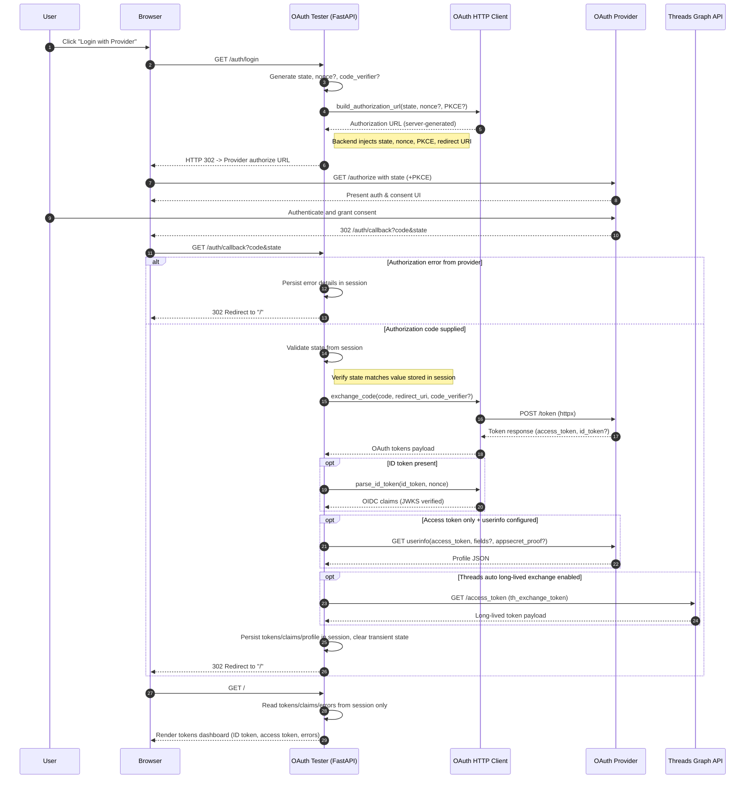

# OAuth Flow Sequence

The diagram below summarizes the interactive login flow implemented by the OAuth Tester application, including optional paths for OIDC verification, user info retrieval, and Threads long-lived token handling.

## Implementation Notes

- The `/auth/login` handler sets the session `state`, optional `nonce`, and PKCE `code_verifier` before asking the manual OAuth client to build an authorization URL, which is returned as a `302` redirect.
- The browser never receives provider metadata directly; the backend composes the full authorize URL, ensuring state/nonce/PKCE stay server-controlled.
- The `/auth/callback` handler validates state, extracts the authorization code, performs the authorization code exchange via `httpx`, and stores resulting tokens, claims, and profile data in the session.
- OIDC providers have ID tokens verified against the configured JWKS (either discovered or manually supplied), with nonce validation handled in the client.
- Non-OIDC providers can expose a user profile by calling the configured or discovered `userinfo_endpoint` with the access token (and optional `appsecret_proof`).
- Threads-specific logic can automatically exchange or refresh long-lived tokens via the Meta Threads Graph API.
- Any upstream errors (provider redirect errors or token exchange failures) are captured in the session and surfaced on the home view.
- Tokens/claims remain scoped to the FastAPI session; the UI reads them server-side and displays them after the final redirect.

## My Own words

1. browswer call my backend and my backend returns required info, e.g. callback url etc
2. browswer redirects user to provider's login page with information.
3. user login on provider's login page
4. provider returns authenticate user and return to browswer
5. browswer our backend callback url
6. our backend does token exchange and user creation
7. and user gets token in the browser that can be used throughout

Some tweak from AI
Step 1: The browser hits GET /auth/login; the backend immediately builds the provider URL (state, nonce, PKCE) and responds with a 302. It doesn’t first deliver metadata to the browser.
Step 4/5: The provider redirects straight to our callback (/auth/callback). We validate state, grab the code, and perform the token exchange via httpx. No on-the-fly “user creation” happens—tokens/claims are just stored in the session.
Step 6: After the exchange we 302 back to /; the browser loads that page and the UI renders whatever tokens/claims are in session. Those tokens live only in the user’s session storage, not as a global credential store.

### Updated steps

1. Browser requests /auth/login; backend responds with a redirect to the provider’s authorize URL.
2. Browser follows the redirect to the provider; user logs in/consents.
3. Provider redirects back to /auth/callback?code=…&state=….
4. Backend validates state, exchanges the code for tokens, optionally fetches profile data, stores results in session, then redirects to /.
5. Browser requests /; the page displays session-stored tokens/claims.

### Clarifications about the URL information

- Q) Do we need provider's login url that's used by user to login from backend side or frontend side?
- A) 
  - We build and own the provider’s authorize/login URL entirely on the backend. When the browser hits /auth/login, our FastAPI handler calls the manual HttpOAuthClient.build_authorization_url(...), which combines state/nonce/PKCE with the provider’s discovered or configured authorization endpoint. 
  - The backend then issues a 302 redirect to that URL. 
  - The frontend never needs to know the raw provider login URL ahead of time—keeping it server-side lets us inject state, nonce, and PKCE securely before the browser is sent to the provider.
